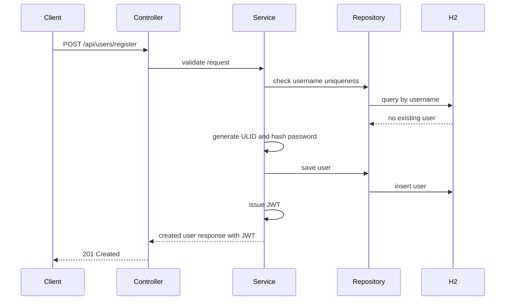
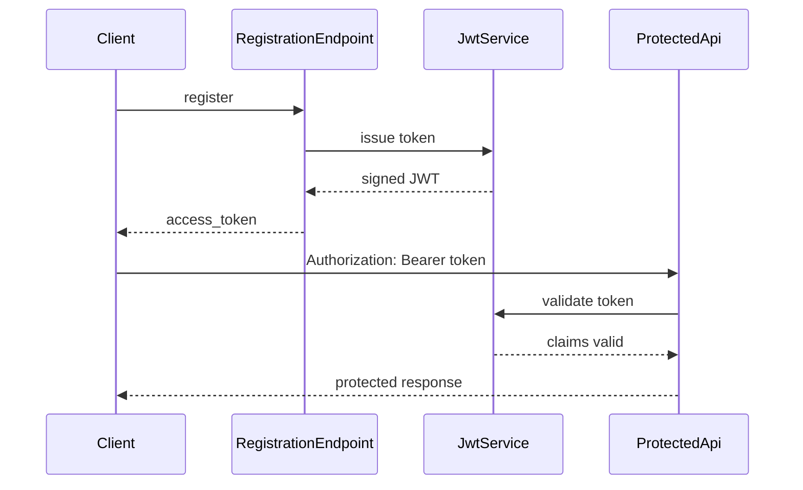

## Context

- 專案目前是小型 Spring Boot Maven 後端 POC。
- 目前只有基本應用程式骨架，尚未建立 REST API、資料庫存取、用戶模型或安全性設定。
- 目標是先以 Java 實作 RESTful API，後續功能完成後再逐步轉換為 Kotlin。
- 開發流程採用 TDD，因此實作前應先建立描述註冊與 JWT 行為的測試。
- 使用 H2 in-memory database，資料會在應用程式重啟後消失。
- 主要利害關係人包含後端 API 開發者、API 消費端或前端整合者、測試與 QA。

## Goals / Non-Goals

**Goals:**

- 提供用戶註冊 API。
- 註冊成功後立即回傳 JWT，讓前端可直接保存並呼叫後續受保護 API。
- 使用 `username` 作為唯一登入識別。
- 使用可選但唯一的 `nickname`。
- 儲存用戶 `id`、`username`、`nickname`、密碼雜湊、建立時間與更新時間。
- 使用 H2 in-memory database 支援本機開發與測試。
- 使用 JWT 作為 API 驗證機制的基礎。
- 使用非單純流水號且可依時間排序的 ID。
- 以測試先行方式定義成功與錯誤情境。

**Non-Goals:**

- 不導入正式 production database。
- 不實作完整帳戶生命週期，例如修改基本資料、註銷帳戶或忘記密碼。
- 不實作登入 API；登入 API 將由後續 proposal 處理。
- 不建立 UI。
- 不處理 refresh token、token 黑名單或多裝置 session 管理。
- 不處理 email 或手機驗證。

## Decisions

- ID 使用 ULID。
  - 理由：ULID 是 26 字元字串，包含時間排序特性，不是單純流水號，適合 API 回傳、索引與除錯。
  - 相較 UUID v4：UUID v4 不具自然時間排序，索引 locality 較差。
  - 相較資料庫自增 ID：自增 ID 容易暴露資料量與建立順序，也不符合「不要使用單純流水號」。
  - 相較 Snowflake：Snowflake 適合分散式高併發 ID，但 POC 階段需要額外節點或 worker 設計，複雜度較高。
- 用戶資料保存 `createdAt` 與 `updatedAt`。
  - 理由：建立時間與更新時間是帳戶資料的基本稽核欄位，也能支援後續排序、除錯與資料同步。
  - 註冊建立資料時，`createdAt` 與 `updatedAt` 應同時設定。
  - 後續修改用戶資料時，應只更新 `updatedAt`，並保留原本的 `createdAt`。
  - 建議使用 Spring Data JPA auditing 或 service 層集中設定，避免各個 controller 手動處理時間欄位。
- 用戶資料使用 JPA entity 與 Spring Data repository。
  - 理由：H2 與 Spring Data JPA 整合成本低，能快速建立資料約束與 repository 測試。
  - 替代方案：直接使用 JDBC template 可降低抽象，但會增加樣板程式碼。
- `username` 在資料庫層設定 unique constraint，並在 service 層轉換為清楚的 API 錯誤。
  - 理由：service 層檢查可提供友善錯誤，資料庫唯一約束可避免併發競態造成重複資料。
- `username` 僅允許英數字與底線，長度最少 8 個字元、最多 15 個字元。
  - 理由：限制格式可降低登入識別的清理與顯示複雜度。
- `nickname` 不必填，空白視為未提供；若提供則必須唯一，且最多 30 個字元。
  - 理由：暱稱可作為顯示名稱，但不應強迫註冊時填寫。
  - 實作時需讓空值與空白字串可通過驗證；唯一性只套用於有提供的 nickname。
- 密碼使用 BCrypt 雜湊。
  - 理由：Spring Security 直接支援 BCrypt，適合密碼儲存，不需要自行實作雜湊策略。
  - 替代方案：Argon2 安全性也好，但需要額外依賴與參數管理；POC 階段先採用 Spring 生態常見的 BCrypt。
- 密碼規則為最小長度 8，且必須包含英文大寫、英文小寫、數字與至少一個特殊符號。
  - 理由：比單純長度限制更能避免過弱密碼。
- 註冊 API 預設不要求既有 JWT。
  - 理由：新用戶尚未有 token，註冊應是公開 endpoint。
- 註冊成功後立即回傳 JWT。
  - 理由：使用者註冊後可直接進入登入狀態，前端能立即保存 token 並呼叫後續 API。
  - 登入 API 不在本次 change 中實作，將由後續 proposal 處理。
- JWT 使用 Spring Security OAuth2 JOSE / Resource Server 與對稱式簽章密鑰。
  - 理由：POC 階段部署單一服務，對稱式密鑰簡單且足夠。
  - JWT 簽發與驗證使用 Spring Security 的 `JwtEncoder` / `JwtDecoder`，避免維護自製 HMAC、Base64URL 與 claims 解析邏輯。
  - 替代方案：非對稱金鑰較適合多服務或第三方驗證場景，但目前超出需求。
- JWT 有效期限設定為 1 hour。
  - 理由：POC 階段先採用短期 access token，降低 token 洩漏後的有效風險，也符合註冊後直接登入的使用流程。
- 註冊成功 response 的 JWT 欄位名稱使用 `access_token`。
  - 理由：能與後續可能加入的 refresh token 欄位清楚區分。
- API 回應使用 JSON DTO，不直接回傳 entity。
  - 理由：避免洩漏密碼雜湊與內部資料模型。
- 錯誤回應統一使用 `code`、`message`、`details`。
  - 理由：前端與測試能穩定判斷錯誤類型，也利於後續 API 擴充。

## Registration Flow

## JWT Flow

## Risks / Trade-offs

- [Risk] H2 in-memory database 會在重啟後清空資料。→ Mitigation：明確將此 change 定位為 POC 與測試用途，production DB 另行規劃。
- [Risk] 註冊成功即回傳 JWT 會讓註冊 endpoint 同時承擔建立帳戶與建立登入狀態。→ Mitigation：維持登入 API 不在本次 change，並將 token 產生邏輯集中在 JWT service，後續登入 API 可重用。
- [Risk] `nickname` 可為空但若提供需唯一，資料庫唯一約束在不同資料庫對空值處理可能不同。→ Mitigation：POC 以 H2 驗證；service 層只對非空 nickname 檢查唯一性，未來 production DB 再確認索引策略。
- [Risk] JWT secret 若硬編碼會造成安全風險。→ Mitigation：透過 application 設定注入，測試使用固定值，正式環境改用環境變數或 secret manager。
- [Risk] 只做 service 層 username 檢查仍可能遇到併發重複寫入。→ Mitigation：同時保留資料庫 unique constraint，捕捉 constraint violation 後轉為衝突錯誤。
- [Risk] 過早導入完整 Spring Security 設定可能增加 POC 複雜度。→ Mitigation：先實作最小 JWT support，保留清楚測試邊界。

## Migration Plan

- 新增 Maven dependencies：Spring Web、Spring Data JPA、Spring Security、Spring Security OAuth2 JOSE / Resource Server、H2、JWT 支援、ULID 支援。
- 新增 H2/JPA/JWT 設定至 `application.yaml`。
- 先新增註冊成功且回傳 JWT、username/nickname 唯一性、輸入驗證、統一錯誤格式、密碼不明文儲存、ULID、建立時間與更新時間等測試。
- 實作用戶 entity、repository、service、controller 與 DTO。
- 新增 JWT service 與 Spring Security resource server 設定。
- 執行 `./mvnw test` 驗證。
- 回滾時移除新增類別、測試、dependencies 與設定；若需要快速停用，先移除註冊 endpoint mapping。

## Open Questions

- 無。
