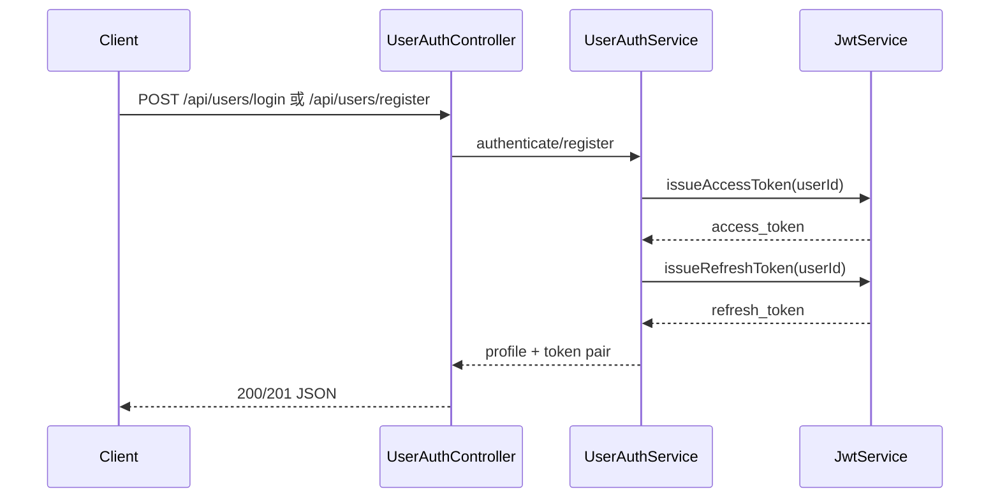
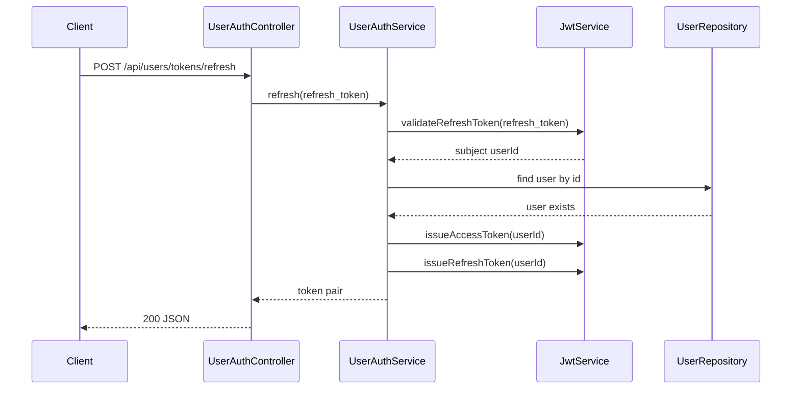

## Context

目前註冊與登入成功後會簽發 access token，受保護 API 透過 Spring Security resource server 驗證 bearer token。Access token 生命週期較短，client 在 token 過期後只能重新登入；本次設計要加入 refresh token，讓 client 可以透過 refresh endpoint 取得新的 token pair。

現有 auth scope 已集中在 `UserAuthController` / `UserAuthService`，路徑集中在 `UserAuthRoutes`，JWT 簽發與解析集中在 `JwtService`。本次變更應延續這個邊界，避免讓 security config 依賴 controller，並維持 API response JSON key 使用 `snake_case`。

## Goals / Non-Goals

**Goals:**

- 註冊與登入成功時同時回傳 `access_token` 與 `refresh_token`。
- 新增 refresh endpoint，讓 client 使用有效 refresh token 換取新的 `access_token` 與新的 `refresh_token`。
- Refresh token 使用 JWT 格式，並與 access token 使用相同 signing infrastructure。
- Access token 與 refresh token 必須能在 server 端被區分，避免 access token 被拿來 refresh。
- Protected API bearer authentication 必須只接受 access token，避免 refresh token 被拿來呼叫一般受保護 API。
- Refresh token expiration 需由設定控制，不在測試或程式碼中複製 magic duration。

**Non-Goals:**

- 不實作 logout。
- 不實作 refresh token revocation、denylist、rotation reuse detection。
- 不新增 server-side session 或多裝置 session 管理。
- 不改變既有 protected API 對有效 access token 的 bearer authentication 行為。
- 不導入 OAuth 2.0 token endpoint、grant type、client authentication 或 authorization code flow。

## Decisions

### 1. Refresh token 使用 JWT，並加入 token type claim

Refresh token 由 `JwtService` 簽發，使用現有 `JwtEncoder` / `JwtDecoder` 與 signing secret。Access token 與 refresh token 都保留 user id 作為 subject，但新增 token type claim，例如 `token_type=access` / `token_type=refresh`。

選擇此作法的原因：
- 符合本次「儲存在 JWT 中」的需求，不需要新增 DB table。
- 可沿用 Spring Security JWT infrastructure。
- `token_type` 可以避免 refresh endpoint 接受 access token。

替代方案：
- Opaque refresh token + DB 儲存 hash：較容易支援撤銷與 reuse detection，但超出本次 POC 範圍。
- 只靠不同 expiration 區分 token：實作較少，但無法可靠避免 token 誤用。

### 2. Refresh endpoint 使用 `POST /api/users/tokens/refresh`

新增 endpoint：

- Method: `POST`
- Path: `/api/users/tokens/refresh`
- Request body: `{ "refresh_token": "<jwt>" }`
- Success response: `{ "access_token": "<jwt>", "refresh_token": "<jwt>" }`

此路徑延續目前 `/api/users/...` 的 user auth scope，同時把 token renewal 表達為 token resource 下的 refresh 操作。Response 只回 token pair，不回 user profile；profile 已由 login/register 回傳，refresh 的目的只是在 token 過期後更新 credentials。

替代方案：
- `POST /api/users/refresh`：較貼近現有 login/register 命名，但 resource 語意較弱。
- `POST /api/auth/refresh`：auth scope 清楚，但會引入新的 top-level route scope，與目前 `UserAuthController` 收斂方向不一致。
- `POST /oauth2/token` 搭配 `grant_type=refresh_token`：標準化程度較高，但對目前單一服務 POC 來說設計較重，且會引入與既有 API error shape 不一致的 token endpoint contract。

### 3. Refresh endpoint 是 public route，但只接受有效 refresh token

Refresh endpoint 不應要求有效 access token，因為它的主要使用情境就是 access token 已過期。Security config 會將 refresh endpoint 設為 `permitAll`，由 service layer 解析 request body 中的 `refresh_token` 並驗證：

- refresh token 存在且非 blank
- JWT 簽章有效
- JWT 未過期
- subject 對應的 user 仍存在
- token type claim 必須是 `refresh`

失敗時回傳標準 auth error，不揭露 token 是過期、格式錯誤、簽章錯誤，或 user 不存在。

### 4. Token expiration 分開設定

`JwtProperties` 新增 refresh token expiration，例如：

- `app.jwt.access-token-expiration`
- `app.jwt.refresh-token-expiration`

測試透過注入 `JwtProperties` 取得 expected duration，不在測試中硬編碼設定值。Access token 現有設定保持不變，refresh token 使用較長生命週期，具體預設值在實作時放在 `application.yaml`。

### 5. Refresh 會回傳新的 refresh token，但不撤銷舊 refresh token

每次 refresh 成功都會簽發新的 access token 與新的 refresh token。因本次不引入 server-side storage、revocation 或 token family state，舊 refresh token 在過期前仍可能繼續有效。

這是本次 POC 的明確 trade-off。登出撤銷、refresh token reuse detection、token family invalidation 會留到後續 change。

### 6. Response DTO 依用途拆分

註冊與登入可沿用既有 top-level profile response，新增 `refreshToken` 欄位後由 Jackson 輸出為 `refresh_token`。Refresh endpoint 使用較小的 token-only response DTO，只包含 `accessToken` 與 `refreshToken`。

此作法避免 refresh response 混入不必要 profile 欄位，也讓未來 logout/session 功能擴充時 API contract 更清楚。

### 7. Resource server 只接受 access token

Spring Security resource server 會在 JWT decoder 上保留預設 JWT validator，並額外驗證 `token_type=access`。因此 refresh token 即使簽章有效且尚未過期，也不能作為 Bearer token 呼叫 protected API。

## Sequence Diagrams

### Login / Register token issuance

### Refresh token renewal

## Risks / Trade-offs

- Refresh token 無 server-side revoke 能力 → 登出撤銷與 token family invalidation 會在後續 change 補上；本次 specs 需明確標示 out of scope。
- 舊 refresh token 在過期前仍可使用 → 短期以較短且可設定的 refresh-token expiration 控制風險，後續以 DB-backed revocation 改善。
- Access token 與 refresh token 共用 signing secret → 透過 `token_type` claim、resource server access-token validator 與不同 expiration 降低誤用風險；若未來安全要求提高，可改為不同 secret/key。
- Refresh endpoint 設為 public route → service layer 必須完整驗證 request body token，並對所有失敗情境回一致的 auth error。
- JWT claim 名稱若散落會形成 magic string → token type claim key/value 應集中定義在 JWT 相關常數或 enum。

## Migration Plan

1. 新增 refresh token expiration 設定。
2. 擴充 `JwtService`，支援 access token / refresh token 簽發與 refresh token 驗證。
3. 擴充註冊與登入成功 response，加入 `refresh_token`。
4. 新增 refresh request / response DTO 與 controller endpoint。
5. 更新 security config，允許 refresh endpoint 未帶 access token 時可呼叫。
6. 更新 resource server JWT validator，只接受 `token_type=access` 的 bearer token。
7. 補齊 API tests 與 JWT-focused tests。

Rollback strategy：移除 refresh endpoint、refresh token DTO、refresh token JWT 邏輯與 `refresh_token` response 欄位，並將註冊/登入 response 恢復為只回 `access_token`。

## Resolved Decisions

- Refresh token 有效期限由 `app.jwt.refresh-token-expiration` 控制。
- Refresh token 驗證失敗統一回 `401 Unauthorized` 與 `INVALID_REFRESH_TOKEN`，避免使用 `Authentication is required.` 這類較像缺少 access token 的語意；不細分過期、簽章錯誤、token type 錯誤或使用者不存在。
