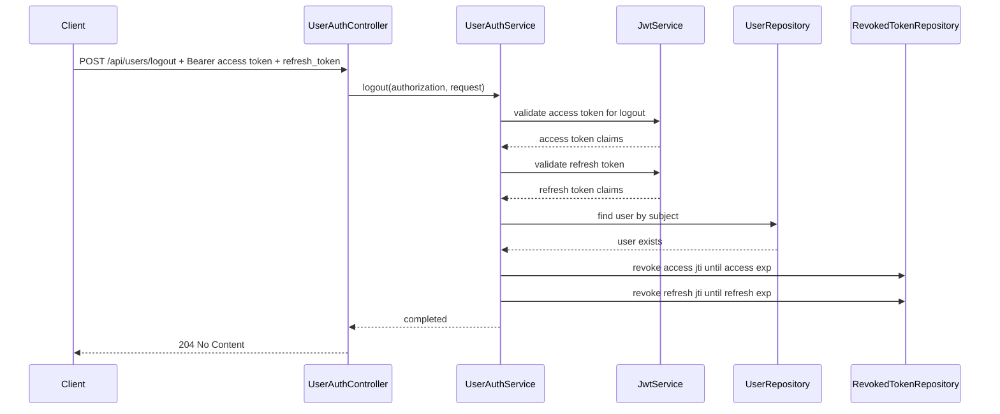
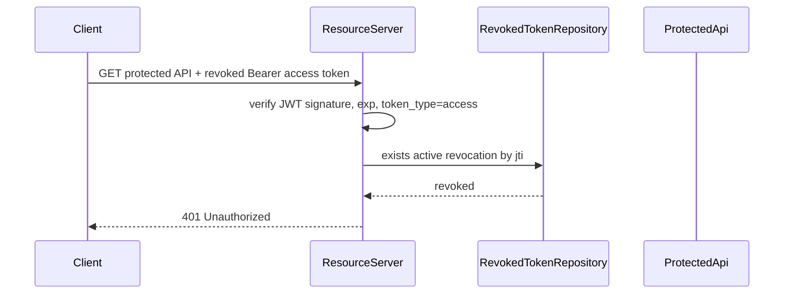

## Context

目前註冊與登入會簽發 access token 與 refresh token，refresh endpoint 可用有效 refresh token 換發新的 token pair。Access token 與 refresh token 都是 JWT，已透過 `token_type` claim 區分用途；protected API 由 Spring Security resource server 驗證 bearer access token。

目前 token 仍是 stateless：JWT 沒有可撤銷的 token id，server 也沒有 token revocation state。因此若要讓登出後 access token 與 refresh token 立即失效，必須加入 server-side revocation persistence，並讓 protected API 與 refresh endpoint 都查詢撤銷狀態。

本次登出延續既有 `/api/users/...` auth scope，endpoint 使用 `POST /api/users/logout`。

## Goals / Non-Goals

**Goals:**

- 新增目前裝置登出 API：`POST /api/users/logout`。
- 登出 request 使用 Authorization bearer access token，並在 body 提供 `refresh_token`。
- 登出成功撤銷目前 access token 與 refresh token。
- 登出成功回 `204 No Content`，不回 response body。
- 同一組 token pair 重複登出時維持 idempotent，仍回 `204 No Content`。
- Protected API 必須拒絕已撤銷的 access token。
- Refresh endpoint 必須拒絕已撤銷的 refresh token。

**Non-Goals:**

- 不實作登出所有裝置。
- 不新增 session list 或 server-side session 管理 API。
- 不實作 refresh token reuse detection 或 token family invalidation。
- 不把 refresh token 改為 opaque token。
- 不改變 register、login、refresh 成功 response shape。

## Decisions

### 1. JWT 加入 `jti` 作為撤銷鍵

Access token 與 refresh token 簽發時都加入標準 JWT ID claim `jti`。撤銷時只儲存 token id，不儲存原始 token 字串。

選擇此作法的原因：

- 可以精準撤銷單一 access token 或 refresh token。
- 不需要把敏感 token 原文存進資料庫。
- 與 JWT 標準 claim 相容，未來也能支援 token family 或 audit。

替代方案：

- 儲存整個 JWT 或 JWT hash：可行，但資料較大，也較容易把 token 原文處理帶進 persistence 邏輯。
- 只記 user-level `logoutAfter` timestamp：可以讓某時間以前的 access token 失效，但無法只登出目前裝置，也會影響其他裝置。

### 2. 新增 revoked token persistence

新增 revoked token 儲存模型，例如 `revoked_tokens`：

- `token_id`: token 的 `jti`，唯一鍵
- `user_id`: token subject
- `token_type`: `access` 或 `refresh`
- `expires_at`: token 原本的到期時間
- `revoked_at`: 撤銷時間

登出時將 access token 與 refresh token 的 `jti` 寫入 revoked token store。若同一 token id 已存在，視為已撤銷，不視為錯誤。

Revocation insert 使用獨立 transaction 執行，並在 transaction 邊界外將 duplicate token id 視為 idempotent 成功。這可避免併發重複登出時，DB unique constraint failure 污染呼叫端的 logout transaction，導致原本應回 `204 No Content` 的重試變成 rollback failure。

選擇此作法的原因：

- 能支援 idempotent logout。
- `expires_at` 讓後續清理過期撤銷紀錄有依據。
- token type 可避免 access 與 refresh 驗證邏輯混用。
- duplicate revocation failure 不會讓外層 logout transaction 被標記為 rollback-only。

替代方案：

- 只儲存 refresh token revocation：無法滿足 access token 登出後立即失效。
- 建立完整 session table：較適合多裝置 session 管理，但超出本次範圍。

### 3. Logout endpoint 由 service 驗證 token，而不是由 resource server 攔截

`POST /api/users/logout` 在 SecurityConfig 層設為 `permitAll`，但 `UserAuthService.logout` 必須自行驗證：

- Authorization header 存在且為 bearer access token
- access token JWT 簽章有效、未過期、`token_type=access`
- request body 存在且 `refresh_token` 非 blank
- refresh token JWT 簽章有效、未過期、`token_type=refresh`
- access token 與 refresh token subject 指向同一 user
- user 仍存在

此設計看似與「登出需要有效 access token」有落差，但實際上只是把驗證責任從 security filter 移到 service。原因是登出必須 idempotent：第一次登出後 access token 會被撤銷；若第二次同 token pair 再送到 logout endpoint，resource server 若先檢查 revoked access token，request 會在進 service 前被拒絕，無法回 `204 No Content`。

登出 endpoint 對已撤銷 token 的處理：

- access token 與 refresh token 都可解析、未過期、type 正確、subject 一致時，即使其中一個或兩個已在 revoked store，也回 `204 No Content`。
- 若 token 格式錯誤、簽章錯誤、過期、type 錯誤或 subject 不一致，則回對應 auth error。

替代方案：

- logout 也走 resource server authentication：實作較直覺，但會破壞重複登出的 idempotency。
- logout 完全不驗 access token，只看 refresh token：可撤銷 refresh token，但無法可靠撤銷目前 access token。

### 4. Protected API 與 refresh endpoint 都檢查 revocation

Protected API 的 resource server access-token validator 會維持現有檢查：JWT 預設驗證、`token_type=access`，並新增 revoked-token check。若 access token 的 `jti` 已撤銷，protected API 回 `401 UNAUTHORIZED`。

Refresh endpoint 在 `validateRefreshToken` 或 service 層驗證 refresh token 時，也要檢查 refresh token `jti` 是否已撤銷。若已撤銷，回 `401 INVALID_REFRESH_TOKEN`。

Refresh endpoint 不以 Authorization header 的 access token 作為認證條件；`refresh_token` 是唯一用來換發 token pair 的憑證。即使 client 帶著已過期的 bearer access token header，只要 body 內的 refresh token 有效且未撤銷，refresh 仍應成功，避免 access token 過期後反而阻擋換發流程。

選擇此作法的原因：

- access token 與 refresh token 的失效行為分別落在最接近使用點的位置。
- protected API 不需要知道 refresh token 概念。
- refresh endpoint 保持既有錯誤語意，不揭露 token 是過期、格式錯誤或已撤銷。
- refresh endpoint 不依賴 access token 狀態，符合 access token 過期後用 refresh token 換發的使用情境。

替代方案：

- 在 controller 中集中檢查 revocation：會讓 protected API 覆蓋不完整，且與 Spring Security resource server 分工不一致。

### 5. Error 與 response contract

成功登出回：

- HTTP status: `204 No Content`
- Response body: empty

失敗時：

- 缺少或無效 Authorization bearer access token：`401 UNAUTHORIZED`
- 缺 body、缺 `refresh_token`、blank refresh token、invalid refresh token、expired refresh token、revoked refresh token：`401 INVALID_REFRESH_TOKEN`
- access token 與 refresh token subject 不一致：`401 INVALID_REFRESH_TOKEN`

`204 No Content` 適合登出成功，因為 client 不需要新資料，只需要知道 server 已完成撤銷。Client 收到 `204` 後即可清除本機保存的 access token 與 refresh token。

## Sequence Diagrams

### Successful Logout

### Revoked Access Token Rejected by Protected API

## Risks / Trade-offs

- [Risk] Revocation check adds DB lookup to protected API authentication. -> Mitigation: keep lookup narrow by unique `token_id`; this is acceptable for POC. Future optimization can add cache if needed.
- [Risk] Revoked token rows can grow over time. -> Mitigation: store `expires_at` and allow expired rows to be deleted opportunistically or by a future cleanup task.
- [Risk] Logout route is `permitAll` at security config level. -> Mitigation: service performs full access token and refresh token validation before revoking; route is only public to preserve idempotent retry after revocation.
- [Risk] Current-device logout does not revoke other refresh tokens for the same user. -> Mitigation: document logout-all-devices and session management as out of scope for this change.
- [Risk] Stateless JWT plus revocation persistence is a hybrid model. -> Mitigation: constrain persistence to token revocation only; do not introduce broader session state in this change.

## Migration Plan

1. Add `jti` claim to newly issued access and refresh tokens.
2. Add revoked token entity/repository/service.
3. Add logout request DTO and route constant for `POST /api/users/logout`.
4. Add logout service flow that validates both tokens, confirms same user, and records revocations.
5. Update resource server access-token validator to reject revoked access token ids.
6. Update refresh token validation to reject revoked refresh token ids.
7. Add API tests for logout success, idempotent logout, invalid inputs, revoked access token rejection, and revoked refresh token rejection.

Rollback strategy：移除 logout endpoint、revoked token persistence、`jti`-based revocation checks，並恢復 access token 與 refresh token 只依 JWT 簽章、expiration、token type 判斷有效性的行為。若已存在 revoked token table，在 POC 環境可直接移除；正式環境需以 migration drop table 或保留未使用 table 的方式回滾。

## Open Questions

- 無。
