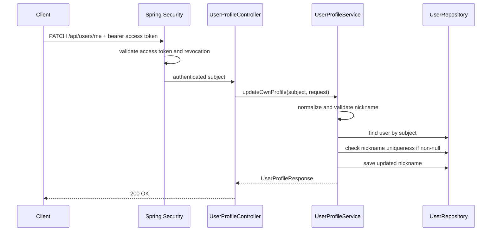

## Context

目前用戶認證相關 API 已拆在 `user.auth`，帳號資料模型位於 `user.account`。本變更要新增已登入使用者修改自己基本資料的能力，但目前 scope 僅允許修改 `nickname`，不應讓 auth service 繼續累積 profile 維護職責。

此 API 必須沿用現有 JWT access token 驗證、revoked token 檢查、API error catalog、欄位 enum 與 snake_case response 規則。資料表不新增欄位；更新的是既有 `user_account.nickname`，並由 entity lifecycle 更新 `updatedAt`。

## Goals / Non-Goals

**Goals:**

- 新增 authenticated user profile 更新 API，僅更新目前 access token subject 對應帳號的 `nickname`。
- 將 profile 更新職責放入獨立 `user.profile` package，避免塞進 `user.auth`。
- 成功後回傳更新後的 user profile，不簽發新的 access token 或 refresh token。
- 沿用既有 nickname 長度與唯一性規則，並集中管理錯誤 code、message、field 與路徑常數。

**Non-Goals:**

- 不新增管理員修改任意使用者資料的 API。
- 不允許修改 `username`、`password`、user id、token 或 session/revocation 狀態。
- 不改變 register、login、refresh、logout 的成功 response、token 發行或 token 驗證 contract；missing request body 統一回歸框架層處理並回 `400 Bad Request` / `VALIDATION_ERROR`。
- 不新增資料表、migration 或外部依賴。

## Decisions

### 1. Endpoint 採 `PATCH /api/users/me`

使用 `PATCH` 表示部分更新，`/me` 表示資源由目前 authenticated user 決定。Controller 放在 `com.example.demo.user.profile`，新增 `UserProfileRoutes` 集中定義 `BASE_PATH`、`ME_ROUTE` 與完整 path。

替代方案：

- `PATCH /api/users/{id}`：需要處理 path user id 與 token subject 是否一致，對本需求增加不必要的跨使用者風險。
- `PATCH /api/users/profile`：可行，但 `/me` 更明確表達「目前使用者」。

### 2. Service 透過 authentication subject 查找 user

Spring Security 先驗證 bearer access token，controller 再把 authenticated principal 交給 `UserProfileService`。Service 以 token subject 查詢 `UserRepository.findById(...)`，找不到時回 `401 Unauthorized`，避免透露帳號存在狀態。

成功流程：

### 3. Request 只有 nickname 會生效，nickname 必填，空字串或 blank 視為清除 nickname

新增 `UpdateUserProfileRequest`，可修改欄位只有 `nickname`。現階段 `nickname` 欄位必填；若 request body 省略 `nickname` 欄位，或明確傳入 `null`，系統會回 validation error。若傳入空字串或全空白字串，系統將 nickname 正規化成 `null`，表示清除 nickname；非空值會 trim 後檢查長度與唯一性。

若 request 夾帶未知欄位、`username`、`password`、`id` 或 token 欄位，系統會忽略這些欄位，不回 validation error，也不會套用到資料。實作上可使用 DTO 僅暴露 `nickname` 並保留 Jackson 預設忽略未知欄位的行為；測試必須驗證這些欄位不會改變，且 request 不會只因為額外欄位而失敗。

### 4. Nickname 驗證獨立在 profile validation

新增 profile 專用 validator，例如 `UserProfileValidator` 與 `ValidatedUserProfileUpdate`。nickname 最大長度使用既有 `RegistrationValidationRules.NICKNAME_MAX_LENGTH` 或後續可抽成共用 user field rule，避免 duplicate magic number。

不直接重用 `RegistrationValidator`，因為 registration validator 同時處理 username/password/body required 等語意；profile update 只需要 nickname required、nickname 長度與清除語意，重用整支 registration validator 會讓責任混在一起。

### 5. Response 使用 profile 專用 DTO

新增 `UserProfileResponse`，只包含 `id`、`username`、`nickname`、`created_at`、`updated_at`。不要重用 `UserAuthResponse`，因為 auth response 會回 token，profile 更新不應造成 token 輪替。

profile update response 的 `nickname` 是固定 contract 欄位。資料層仍以 `null` 表示沒有暱稱，但 profile response 必須把被清除的 nickname 顯示為空字串 `""`，避免 client 端同時處理 `null` 與字串兩種顯示型態。此轉換只應放在 profile response 邊界，避免改動 register/login 既有 response contract 或資料儲存語意。

### 6. Entity 提供明確更新方法

在 `UserAccount` 加入 `updateNickname(String nickname)`，由 entity 封裝可變欄位，而不是開放通用 setter。`@PreUpdate` 維持負責刷新 `updatedAt`。

Service 必須先比較正規化後的目標 nickname 與目前 nickname；若目標 nickname 與目前值相同，視為 no-op 並直接回傳目前 profile，不呼叫 `updateNickname(...)`、不 save/flush，也不刷新 `updatedAt`。只有 nickname 實際變更時才更新 entity，讓 `@PreUpdate` 刷新 `updatedAt`。

### 7. 錯誤處理沿用 catalog

- 未帶、無效、過期或已撤銷 access token：由 security layer 回 `401 UNAUTHORIZED`。
- missing request body：由 Spring MVC `@RequestBody` required 行為攔截，經全域 exception handler 回 `400 VALIDATION_ERROR`。
- 省略 `nickname` 或 `nickname: null`：回 validation error，field 使用 `ErrorField.NICKNAME`。
- nickname 超過長度：回 validation error，field 使用 `ErrorField.NICKNAME`。
- nickname 已被其他使用者使用：回 `409 NICKNAME_ALREADY_EXISTS`。
- nickname 與自己目前 nickname 相同：視為成功，不回 conflict。

若新增 validation error key，需加入 `ApiErrorKey` 與 `ApiErrorCatalog`，不要在 throw site 寫死 code 或 message。

## Risks / Trade-offs

- [Risk] DTO 忽略未知欄位可能讓 client 誤以為 username/password 已更新。→ 測試覆蓋 forbidden fields 不會變更，spec 明確寫未知或不可修改欄位會被忽略且不回 validation error。
- [Risk] 資料層以 `null` 表示沒有暱稱，但 profile response contract 要顯示空字串。→ profile response DTO 在輸出邊界將 `null` 轉成 `""`，並以清除 nickname 的 API 測試驗證。
- [Risk] nickname uniqueness 仍可能遇到併發 unique constraint。→ 正常路徑先查重並回 `409 NICKNAME_ALREADY_EXISTS`；若 save/flush 發生 DB constraint race，POC 階段比照 registration 策略回 generic conflict，暫不細分 constraint 來源。
- [Risk] profile validator 與 registration validator 都會碰到 nickname 規則。→ 長度限制集中使用共用常數，validator 保持各自 request 語意。
- [Risk] 新增 authenticated endpoint 可能誤被 permitAll。→ SecurityConfig 測試覆蓋無 token、refresh token 作 bearer、revoked token 等拒絕情境。

## Migration Plan

1. 新增 `user.profile` controller/service/routes/dto/validation 與測試。
2. 在 security 設定中讓 `PATCH /api/users/me` 維持 authenticated，不加入 permitAll 或 ignored Authorization route。
3. 新增 `UserAccount.updateNickname(...)` 並透過既有 repository 儲存。
4. 若需要新增 catalog key 或 field，與測試一併更新。
5. 將既有 request-body endpoint 的 missing body 行為回歸框架層，並同步更新主規格與測試。

Rollback 時移除 profile package、route 設定與 entity 更新方法；資料庫 schema 不需變更。

## Open Questions

- 無。
