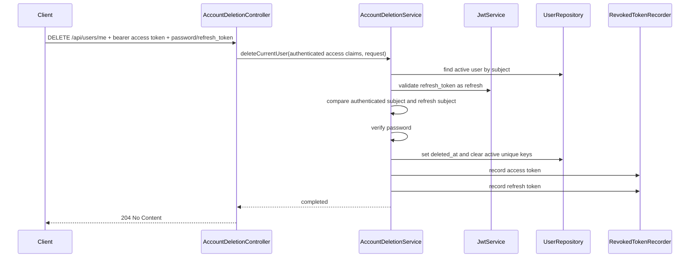

## Context

目前帳號資料存在 `UserAccount`，`username` 與 `nickname` 以單欄 unique constraint 保證唯一。認證流程已具備 access token、refresh token、token revocation、logout 與 profile update；POC inspection API 會讀出所有 user rows 與 revoked token rows。

本變更採 soft delete，表示註銷時不能直接刪除 `user_account` row，但註冊又必須允許已註銷帳號的 `username` / `nickname` 被重新使用。因此單純新增 `deleted_at` 並把 repository 查詢改成只看 active users 不夠，因為既有 DB unique constraint 仍會被 soft-deleted row 擋住。

## Goals / Non-Goals

**Goals:**

- 新增 `DELETE /api/users/me`，讓 authenticated user 註銷自己的帳號。
- 使用 `deleted_at` 表示 soft-deleted account，不 hard delete user row。
- 刪除 request 必須帶 `password` 與 `refresh_token`，並驗證 authenticated user、密碼與同 user refresh token。
- 成功刪除時 revoke submitted access token 與 submitted refresh token，回 `204 No Content`。
- 已註銷帳號不可 login、logout、refresh token、profile update。
- 註冊時只把 active users 視為 username / nickname 衝突，允許重用已註銷帳號的 username / nickname。
- Profile update nickname uniqueness 只針對 active users，允許重用已註銷帳號的 nickname。

**Non-Goals:**

- 不新增 hard delete、restore account、admin delete 或 admin inspection API。
- 不新增 logout-all-devices、session list、server-side session management、refresh token reuse detection 或 token family invalidation。
- 不嘗試 revoke 同一使用者所有已簽發 token；只有 submitted access token 與 submitted refresh token 會被記錄到 revoked token table。
- 不把 `deleted_at` 加到 register/login/profile 的正式 user-facing response。

## Decisions

### 1. Endpoint 採 `DELETE /api/users/me`

新增 account deletion controller/service，route 與 user profile 一樣使用 `/api/users/me`，但 HTTP method 使用 `DELETE` 表示註銷目前 authenticated user。Controller 讀取 `Authorization` header 與 required request body；missing body 交給 Spring MVC `@RequestBody` required 行為，沿用全域 `400 VALIDATION_ERROR`。

替代方案：

- `POST /api/users/me/delete`：較容易加 body，但不如 `DELETE /api/users/me` 清楚表達資源刪除語意。
- `DELETE /api/users/{id}`：需要處理 path id 與 token subject 是否一致，對 self-service 註銷增加不必要風險。

### 2. Soft delete 使用 `deleted_at`，active user 查詢一律排除 deleted rows

`UserAccount` 新增 nullable `deletedAt` 欄位與 `softDelete(Instant deletedAt)` 方法。未註銷帳號的 `deletedAt` 為 `null`；註銷成功時設為目前時間。`@PreUpdate` 仍會更新 `updatedAt`，因此 delete operation 也會刷新 `updatedAt`。

Repository 新增 active-user 查詢，例如：

- `findByIdAndDeletedAtIsNull(...)`
- `findByUsernameAndDeletedAtIsNull(...)`
- active username / nickname existence checks

Login、logout、refresh、profile update 與 account deletion 讀取 subject user 時都必須使用 active-user 查詢。找不到 active user 時，對外錯誤沿用各 endpoint 既有 contract：

- login：`401 INVALID_CREDENTIALS`
- logout：`401 UNAUTHORIZED`
- refresh：`401 INVALID_REFRESH_TOKEN`
- profile update：`401 UNAUTHORIZED`
- account deletion：`401 UNAUTHORIZED`

替代方案：

- 所有 service 先 `findById(...)` 再手動檢查 `deletedAt`：容易漏掉，且每個 service 會重複 active 判斷。
- 全域 Hibernate filter：對 POC 與 inspection 不適合，inspection 必須能看到 deleted rows。

### 3. Unique constraint 改用 active unique key 欄位

為了同時保留 soft-deleted row 的原始 `username` / `nickname` 並允許重新註冊相同值，`user_account` 不再直接對 `username` 與 `nickname` 做 unique constraint。改新增內部欄位：

- `active_username_key`
- `active_nickname_key`

Active user 的 key 值等於目前 `username` / `nickname`；soft-deleted user 的 key 值設為 `null`。DB unique constraint 改套在這兩個 key 欄位上。這讓 active users 仍有 DB-level uniqueness，並讓 deleted users 不再占用 username / nickname。

註冊建立 user 時：

- `active_username_key = username`
- `active_nickname_key = nickname`，若 nickname 為 `null` 則維持 `null`

Profile update nickname 時：

- nickname 實際變更時同步更新 `active_nickname_key`
- 清除 nickname 時把 `active_nickname_key` 設為 `null`
- nickname uniqueness 查詢只看 active nickname key 或 active users，因此 soft-deleted user 的 nickname 可被 active user 重用

Account deletion 時：

- 設定 `deleted_at`
- 將 `active_username_key` 與 `active_nickname_key` 設為 `null`

替代方案：

- 刪除時改寫原本 `username` / `nickname` 成 tombstone 值：較簡單，但 inspection 看不到原始資料。
- 使用 partial unique index，例如只在 `deleted_at IS NULL` 時 unique：語意最直接，也不需要額外 active key 欄位；但已用 H2 2.4.240 實測 `CREATE UNIQUE INDEX ... WHERE deleted_at IS NULL`，包含 `MODE=PostgreSQL` 都回 syntax error `[42000-240]`，目前專案的 H2 + `ddl-auto=create-drop` 組合無法採用。若未來正式 DB 改用 PostgreSQL，可重新評估這個方案。
- 使用 `(username, deleted_at)` composite unique：多數 DB 對 `NULL` unique 語意會允許多個 active rows，不能保證 active username 唯一。

### 4. Account deletion request 驗證順序

Spring Security resource server 先驗證 bearer access token，controller 將 authenticated JWT claims 交給 service。Service 不重複解析 bearer access token；service 只驗證 request body 的 `refresh_token`，並用 authenticated subject 與 refresh token subject 做 same-user 檢查。

刪除 flow：

錯誤語意：

- Missing bearer access token、invalid access token、refresh token as bearer、revoked access token：`401 UNAUTHORIZED`
- Missing request body：`400 VALIDATION_ERROR`
- Missing, blank, or wrong `password`：`401 INVALID_CREDENTIALS`
- Missing, blank, invalid, expired, revoked, access-token-as-refresh-token, or cross-user `refresh_token` in the account deletion request body：`401 INVALID_CREDENTIALS`
- Already soft-deleted subject user：`401 UNAUTHORIZED`

Request body 內的 `password` 與 `refresh_token` 都視為刪除帳號所需 credential material；任一缺少或不合法都不對外區分原因，沿用 `INVALID_CREDENTIALS` 與 generic credential invalid message。密碼驗證應在 active user 存在後進行；錯誤密碼不應透露使用者存在以外的額外資訊。

Authorization bearer token 是 endpoint authentication，不屬於 request body credential material；bearer token 缺失、不合法、型別錯誤、revoked 或 subject 已不可用時仍維持 `UNAUTHORIZED`。

### 5. Token revocation 保持 submitted-token scope

成功刪除時只 revoke submitted access token 與 submitted refresh token，沿用 `RevokedTokenRecorder` 的 idempotent insert 行為。其他未提交 token 不會被批次 revoke；但因 user 已 soft-deleted：

- refresh endpoint 會因 subject 找不到 active user 而回 `INVALID_REFRESH_TOKEN`
- logout endpoint 會因 subject 找不到 active user 而回 `UNAUTHORIZED`
- profile update 與其他 authenticated user endpoint 會因 subject 找不到 active user 而回 `UNAUTHORIZED`

這維持目前 POC 已明確排除的 logout-all-devices、session management 與 token family invalidation 邊界。

### 6. SecurityConfig 不把 delete endpoint 加入 permit-all

`DELETE /api/users/me` 必須走 resource server access token 驗證，不加入 `permitAll`，也不加入 custom bearer resolver 的 ignore list。Controller/service 仍需要自行驗證 submitted refresh token，因為 refresh token 不是 bearer credential。Service 使用 authenticated access token claims 記錄 submitted access token revocation，不重複解碼 bearer token。

Logout 與 refresh endpoint 目前是 permit-all 並由 service 自行驗證 token；account deletion 不採這個模式，因為它是 authenticated self endpoint，與 profile update 更接近。

## Risks / Trade-offs

- [Risk] Soft delete 與 unique constraint 互相衝突，導致已註銷帳號仍占用 username / nickname。 -> Mitigation: 使用 `active_username_key` / `active_nickname_key` 承載 active uniqueness，deleted rows 清空 active keys。
- [Risk] active key 與 username/nickname 不同步。 -> Mitigation: 只透過 entity methods 建立、更新 nickname、soft delete，避免直接 setter；測試覆蓋 re-register same username/nickname 與 duplicate active username/nickname。
- [Risk] 未提交的舊 access token 不會被 revoked。 -> Mitigation: 明確維持 POC submitted-token scope；所有 subject-based user action 必須查 active user，因此 deleted subject 會被拒絕。
- [Risk] Logout endpoint 目前是 service-level token validation，若改用 active-user lookup 可能改變舊 token pair 行為。 -> Mitigation: 明確規定 soft-deleted subject logout 回 `401 UNAUTHORIZED`，並補 API test。

## Migration Plan

1. 在 `UserAccount` 新增 `deletedAt`、`activeUsernameKey`、`activeNicknameKey` 欄位，移動 unique constraints 到 active key 欄位。
2. 新增 entity methods：建立時初始化 active keys、nickname update 時同步 active nickname key、soft delete 時設定 `deletedAt` 並清空 active keys。
3. 新增 active-user repository methods，並更新 register/login/refresh/logout/profile update 使用 active-user 語意。
4. 新增 account deletion request DTO、route/controller/service 與 error handling。
5. 補齊 API tests 與 repository/entity 行為測試後跑 `./mvnw test` 與 OpenSpec validation。

Rollback 時移除 account deletion endpoint 與相關 service/DTO/tests，將 register/login/refresh/logout/profile 查詢恢復為既有 user lookup。若資料欄位已加入，POC 的 `ddl-auto=create-drop` 會在重啟時重建 schema；在非 POC DB 中可先保留 nullable 欄位與 active key 欄位不使用，再用 migration 移除。

## Open Questions

- 無。已決定使用 soft delete、`DELETE /api/users/me`、password + refresh token 驗證、submitted token pair revocation、active-user uniqueness，以及 soft-deleted subject logout 回 `401 UNAUTHORIZED`。
