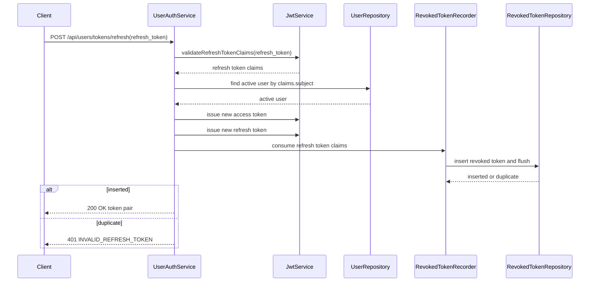

## Context

目前 `POST /api/users/tokens/refresh` 會驗證 request body 內的 `refresh_token`，確認 token 類型、撤銷狀態與 active user 後，直接簽發新的 `access_token` 與 `refresh_token`。既有 `revoked_tokens` table 已可用來記錄被撤銷的 access token 與 refresh token，`JwtService.validateRefreshTokenClaims()` 也已會拒絕 revoked refresh token。

目前缺口是：refresh 成功後，原本提交的 refresh token 沒有被撤銷，因此同一個 refresh token 可以被重複使用。這次變更需要把 refresh token rotation 改成單次使用，同時維持既有 API response shape 與錯誤格式。

## Goals / Non-Goals

**Goals:**

- 成功 refresh 後，立即消耗本次提交的 refresh token。
- 同一個 refresh token 後續再次提交時，回傳 `401 Unauthorized` 與 `INVALID_REFRESH_TOKEN`。
- 使用既有 revoked-token 資料表與檢查流程，不新增新的 session/token-family 資料模型。
- 保持 refresh response 仍只包含 `access_token` 與 `refresh_token`。
- 在並發重複提交同一個 refresh token 時，最多只允許一個請求成功換發。

**Non-Goals:**

- 不實作 token family invalidation。
- 不追蹤 device、session list 或 logout-all-devices。
- 不改變 JWT payload 結構、token expiration 設定或 refresh endpoint URL。
- 不改變 logout 的 idempotent 行為。

## Decisions

### 1. 使用 revoked-token 記錄作為 refresh token 的消耗狀態

refresh 成功時，將本次提交的 refresh token claims 寫入既有 `revoked_tokens` table。之後同一 token 再次提交時，既有 `JwtService.validateRefreshTokenClaims()` 會因 token id 已存在於 revoked-token repository 而拒絕。

替代方案是新增 `used_refresh_tokens` table，但目前 revoked-token table 已具備 token id、user id、token type、expires at、revoked at 欄位，足以表達「此 token 不可再使用」。新增資料表會增加 schema 與查詢路徑，對本變更沒有必要。

### 2. 新增非 idempotent 且參與 refresh transaction 的 consume path

既有 `RevokedTokenRecorder.record()` 會把重複記錄視為成功，且目前以獨立 transaction 記錄撤銷狀態。這對 logout 重複呼叫的 idempotent 語義是正確的，但不適合 refresh token reuse prevention。refresh 需要新的 consume path，例如 `consumeForRefresh(token)` 或同等方法：

- 第一次寫入 revoked-token 成功時才允許 refresh 繼續完成。
- 若 token id 已存在，代表 token 已被消耗或撤銷，refresh 必須回傳 `INVALID_REFRESH_TOKEN`。
- 寫入判斷應以資料庫唯一鍵或 primary key 作為最終保護，避免 check-then-insert 的 race condition。
- consume path 應參與 `UserAuthService.refresh` 的 transaction，不使用 `REQUIRES_NEW`，並在 insert 後 `flush`，讓 duplicate key 能在回傳前被偵測。
- 若 consume 之後同一個 service transaction 發生例外，revoked-token insert 應隨 transaction rollback，避免出現「舊 token 已消耗但新 token 未回傳」的狀態。

替代方案是沿用 `record()`。這可以處理 sequential reuse，但在並發 refresh 下可能讓多個請求都通過驗證並取得新 token，因此不採用。

### 3. 先產生新 token pair，再於同一 transaction 內 consume 舊 refresh token

refresh 流程應先完成所有可預期失敗的驗證，再產生新的 token pair 字串，接著於同一個 service transaction 內消耗原 refresh token，最後才回傳 response。JWT 簽發本身是本機計算，產生字串不會寫入資料庫，也不會對外可見；只有 consume 成功後，這組 token pair 才會被回傳給 client。

這個順序降低「舊 token 已消耗但新 token 尚未產生」的風險；如果 JWT 產生過程失敗，consume 尚未發生。若 consume 成功後、service transaction 完成前又發生例外，revoked-token insert 會 rollback。並發重複提交同一 refresh token 時，只有第一個成功 insert 的請求能回傳 token pair；其他請求即使已在記憶體中產生 token 字串，也不會回傳，並會轉成 `INVALID_REFRESH_TOKEN`。

### 4. `UserAuthService.refresh` 使用一般 transaction，不再標示為 read-only

refresh 成功時會產生 revoked-token 寫入，因此 service method 不應維持 `@Transactional(readOnly = true)`。`UserAuthService.refresh` 應使用一般 `@Transactional`，讓 active user 查詢、refresh token consume 與 service method 內的錯誤處理處於同一個 transaction 邊界。

此 transaction 可以保護資料庫副作用與 method 內例外的一致性，但不能保證 HTTP response 一定送達 client。若 DB commit 已完成但網路中斷或 client 沒收到 response，舊 refresh token 仍會被視為已消耗；要解決這類 delivery uncertainty 需要 idempotency key 或 server-side token exchange state，這超出本變更範圍。

### 5. 錯誤回應維持既有 refresh-token contract

重複使用已消耗 refresh token 與使用已撤銷 refresh token 一樣，對外都回傳 `401 Unauthorized` 與 `INVALID_REFRESH_TOKEN`。這避免暴露 token 狀態差異，也符合現有 refresh-token 驗證錯誤模型。

## Risks / Trade-offs

- [Risk] consume 舊 token 後、method 完成前發生例外，可能造成資料狀態不一致。→ Mitigation：refresh 使用一般 transaction，consume path 參與同一 transaction，不使用 `REQUIRES_NEW`；method 內例外會 rollback revoked-token insert。
- [Risk] DB commit 後 response 未送達 client，client 可能失去舊 refresh token 且未收到新 token pair。→ Mitigation：此風險無法只靠 database transaction 完全避免；本變更不加入 idempotency key 或 server-side token exchange state，client 需重新登入。
- [Risk] 沿用 idempotent recorder 會讓並發 reuse 仍可能成功。→ Mitigation：新增 refresh 專用的非 idempotent consume path，並以資料庫唯一鍵處理 race。
- [Risk] 改變既有測試中「old non-revoked refresh token remains usable until expiration」語義。→ Mitigation：在 delta spec 明確修改此需求，並調整測試為成功 refresh 後舊 token 不可重複使用。
- [Risk] API client 若在收到新 token pair 後仍 retry 舊 refresh token，會開始收到 `INVALID_REFRESH_TOKEN`。→ Mitigation：proposal 已標示受影響 client；client 應在成功 refresh 後立即替換本地保存的 refresh token。

## Migration Plan

1. 更新 refresh-token delta spec，移除或修改舊 token 可重複使用到過期的要求。
2. 新增/調整 API 測試：成功 refresh 後再次提交原 refresh token 應回 `INVALID_REFRESH_TOKEN`。
3. 新增 refresh-token consume path，保留 logout 使用的 idempotent `record()` 行為；refresh consume path 應參與 caller transaction 並 flush。
4. 更新 `UserAuthService.refresh`：取得 claims、確認 active user、產生新 token pair、consume 原 refresh token、回傳新 token pair。
5. 執行相關 auth 測試與完整測試。

Rollback 策略：移除 refresh 成功時的 consume 呼叫，將 `UserAuthService.refresh` 恢復為只驗證 refresh token 並簽發新 token pair，並恢復原本 refresh-token spec 中舊 token 未撤銷前可重複使用的語義。

## Open Questions

- 無待決問題；本變更明確不處理 token family invalidation。
